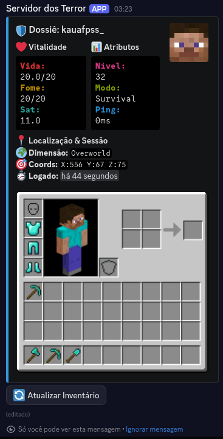

# 📊 ExoMetric-DC - Minecraft Server Status Bot


A premium and highly customizable Discord bot for monitoring Minecraft servers (Java Edition) using the [ExoMetric](https://github.com/zKauaFerreira/ExoMetric) mod. It offers a real-time dashboard, detailed player dossiers, and intelligent notifications.



## ✨ Features

- **📈 Real-time Dashboard**: Monitor CPU, RAM, Connection (In/Out), and online players.
- **🌍 World Details**: Game day, local time, loaded chunks, difficulty, weather, and direct integration with **Chunkbase**.
- **👤 Player Dossier**: Vital information (health, hunger, saturation), attributes, precise coordinates, and **high-performance inventory rendering**.
- **🔔 Intelligent Notifications**: Automatic alerts for login, logout, and server status (Start/Stop) with auto-deletion to keep the channel clean.
- **🎨 Premium Aesthetics**: Use of colored ANSI blocks, animated emojis, and modern design.
- **🛡️ Persistence**: Robust persistent message system that survives restarts.
- **🎒 Powered by Exo-Inventory**: Utilizes the professional [exo-inventory](https://pypi.org/project/exo-inventory/) library for ultra-fast and beautiful rendering.

## 🚀 Installation and Configuration

### 1. Requirements
- Python 3.10+
- A Minecraft server with the **ExoMetric** mod installed.

### 2. Bot Configuration
1. Clone this repository.
2. Copy the `.env.example` file to `.env`:
   ```bash
   cp .env.example .env
   ```
3. Fill in the variables in `.env`:
   - `DISCORD_TOKEN`: Your bot token from the Discord Developer Portal.
   - `API_URL`: ExoMetric mod API URL (e.g., `http://your-ip:25081/mc-stats`).
   - `API_TOKEN`: API key configured in the mod.
   - `MENTION_ROLE_ID`: ID of the role to be mentioned in notifications.

### 3. Notification Options
You can toggle specific alerts on or off in `.env`:
```env
NOTIFY_LOGIN=on
NOTIFY_LOGOUT=on
NOTIFY_SERVER_START=on
NOTIFY_SERVER_STOP=on
```

### 4. Dependency Installation
```bash
pip install -r requirements.txt
```

### 5. Execution
```bash
python3 main.py
```

## 🎮 Commands

- `/setup`: Configures the main status channel. The bot creates the channel automatically if needed and saves the ID to avoid duplicates, even if the channel is renamed.

## 🤝 Acknowledgments
- **[zKauaFerreira](https://github.com/zKauaFerreira)**: For developing the **ExoMetric** mod and the **Exo-Inventory** library.
- **Jemsire**: For the asset and icon infrastructure.
- **Minecraft Community**: For graphical resources and continuous support.

## 🛠️ Technologies Used
- **discord.py**: Interface with the Discord API.
- **exo-inventory**: High-performance Minecraft inventory rendering.
- **Aiohttp**: Asynchronous communication with the server API.
- **Pillow (PIL)**: Image processing through the rendering engine.

---
*Developed to provide the best monitoring experience for Minecraft communities.* 🛡️💎
